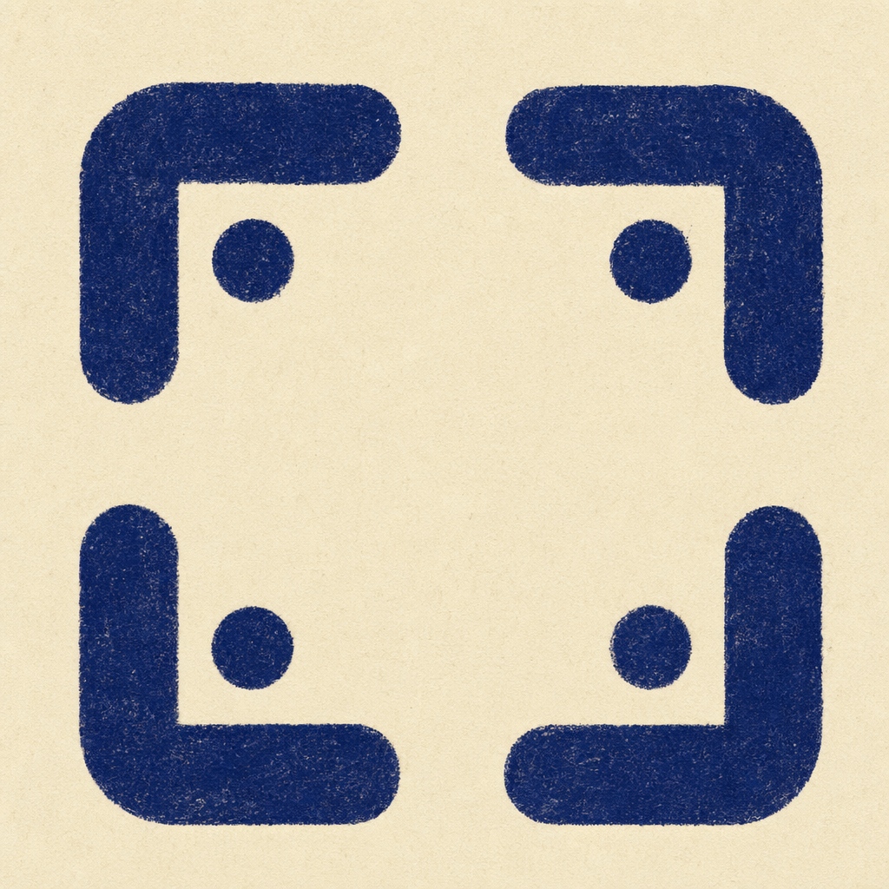

<p align="center">
  
</p>

<h1 align="center">Never Edit</h1>
<p align="center"><em>You don't edit anymore. Adits does.</em></p>

<p align="center">
  <a href="https://adits.ai"><strong>adits.ai</strong></a> · live, in public beta · <a href="https://adits.ai">try the hosted version</a>
</p>

---

# Get started with Adits

Adits is a workspace for making things with an AI coding agent. You drop in files, describe what you want, and the agent does the actual work — writing HTML, editing images, cropping PDFs, rearranging slides, whatever the project needs. A new file lands back on disk. You iterate.

If you've tried **Claude Design**, the surface will feel familiar: a chat on the left, a canvas on the right. Adits takes the same idea and rebuilds it around two principles.

---

## What makes Adits different

### 1. Adits is agent-native. The agent does the work — not us.

Claude Design ships an assistant that lives inside Anthropic's product. Adits doesn't ship one. Every turn hands off to a coding CLI running on the same machine: **Claude Code**, **Gemini CLI**, **Codex**, or **OpenCode**. The agent owns the filesystem, the edits, the tool calls, the multi-turn reasoning.

Adits is the *prompt IDE*. Every surface — the drop zone, the inline tweak knobs, the element picker, the draw overlay, the questions form, the skill chips — is a way to author the next instruction for the agent without having to type it out. The agent is the runtime; Adits is how you compose the turn.

That seam buys you two things:

- **Bring your own CLI, your own subscription.** If `claude` is already logged in on your machine, Adits uses it. No second bill, no captive model, no proxy in the middle.
- **Swap the agent per turn.** Prefer Gemini for one kind of edit and Claude for another? Pick the executor in the composer. The rest of the app doesn't care which one runs.

### 2. Adits is open source and self-hostable. Your files live on your machine.

Adits ships in two modes. The hosted mode runs on our infra. The **self-hosted mode runs entirely on your laptop** — one Node process, one local directory, no cloud.

In self-hosted mode there is no Clerk account, no provisioned VM, no webhook round-trip, no Redis, no managed database. Every project is a plain folder under `~/.adits/projects/<id>/`. Your edits happen in place, against the files sitting on your disk. Sharing a project is `tar czf`. Backing one up is `cp`.

```bash
git clone <repo-url>
cd adits
pnpm install && pnpm build

# Either `claude` is already logged in, or:
export ANTHROPIC_API_KEY=sk-ant-...

export ADITS_BACKEND=local
node --import tsx server/index.ts
# open http://localhost:4001
```

That is the whole install. No Postgres to run, no Redis, no Docker, no account to create.

### 3. Adits is not just for web prototypes.

Claude Design is scoped to HTML-shaped artifacts. Adits opens anything you can drop into a folder, and every file type ships its own viewer and its own in-tab toolbar:

| Type | What you get |
|---|---|
| **HTML pages** | Landing pages, wireframes, slide decks, dashboards, posters. Full editing lanes — Tweaks, Edit, Draw, Comment. |
| **Images** | Canvas viewer with View / Marker / Draw / Crop. Crop exports a PNG you can hand back to the agent. |
| **PDFs** | Page-by-page viewer with draw overlays; crop a region to PNG. |
| **Office docs** | `.docx`, `.xlsx`, `.pptx` render in an embedded editor. |
| **Audio / video** | Native player plus a timeline strip; segment a range to reference in the next turn. |
| **Text / Markdown / CSV** | Inline render, no external dependency. |
| **Sketches (`.napkin`)** | Pen, shapes, arrows, sticky notes — hand the agent a rough drawing instead of typing. |

Adding a new file type is one component — register it, and every tab, chip, and thumbnail in the app picks it up automatically.

---

## The mental model

Two nouns, that's it:

- **Project** — a folder on disk. One project holds one body of related work.
- **Page / file** — anything inside it. The unit of work.

Two panes, that's it:

- **Chat** (left) — the conversation with the agent. It is the project's history: every turn that produced the files you're looking at.
- **Bench** (right) — the project's files, rendered as tabs. A permanent `Design Files` tab lists everything; clicking a file opens it in its own tab.

One rule: **the chat holds the conversation, the bench holds the files.** A file never appears in the chat. A chat turn never appears in the bench. Every gesture you make on the bench side (adjusting a knob, clicking a button, drawing a stroke, leaving a comment) enqueues a chip into the composer — you stack chips, add typed context, and send the whole batch as a single reviewable turn.

---

## Talking to the agent

You can always just type. You usually won't need to:

- **Tweaks** — inline knobs the agent wires up on demand. Pull a slider, flip a toggle, pick a color. Values stay in memory until you hit Save, then they get packaged into one turn.
- **Edit** — click an element on the page and change typography / sizing / layout in a properties panel. Each change applies live and queues a structured instruction for the agent.
- **Draw** — a full-screen canvas overlay. Scribble strokes, drop sticky notes, circle the bit you want changed. On Send, the overlay goes along with the file.
- **Comment** — pin a free-form note to an element. Keep it as feedback for yourself or "Send to Adits" to promote it into an agent instruction.
- **Skills** — pre-made recipes the agent can invoke. *"Make a deck," "Wireframe," "Interactive prototype,"* etc. Pick one from the composer and the agent loads the matching playbook for this turn.

---

## Your first five minutes

1. **Open the Welcome Workspace.** A starter project is seeded on first login with a handful of sample files — a deck, an image, a PDF, a Markdown note. You have something to click on immediately.
2. **Drop a file** into the chat or the bench. Uploads land in the project's `uploads/` folder. The agent can read any of them on the next turn.
3. **Ask for a deck.** `"Make me a 5-slide deck about <topic>."` The agent picks up the `make-a-deck` skill, writes an HTML file that works standalone in any browser, and drops it into `Design Files`.
4. **Tweak it.** Click into the deck's properties. Pull a slider. Circle a title with Draw. Add a sticky note. Hit Send. The agent applies everything in one turn.
5. **Export it.** Page → HTML bundle. Deck → PPTX or PDF. Image → PNG. Your files are your files.

---

That's the whole shape. Project in, files out, an agent you control in the middle.
